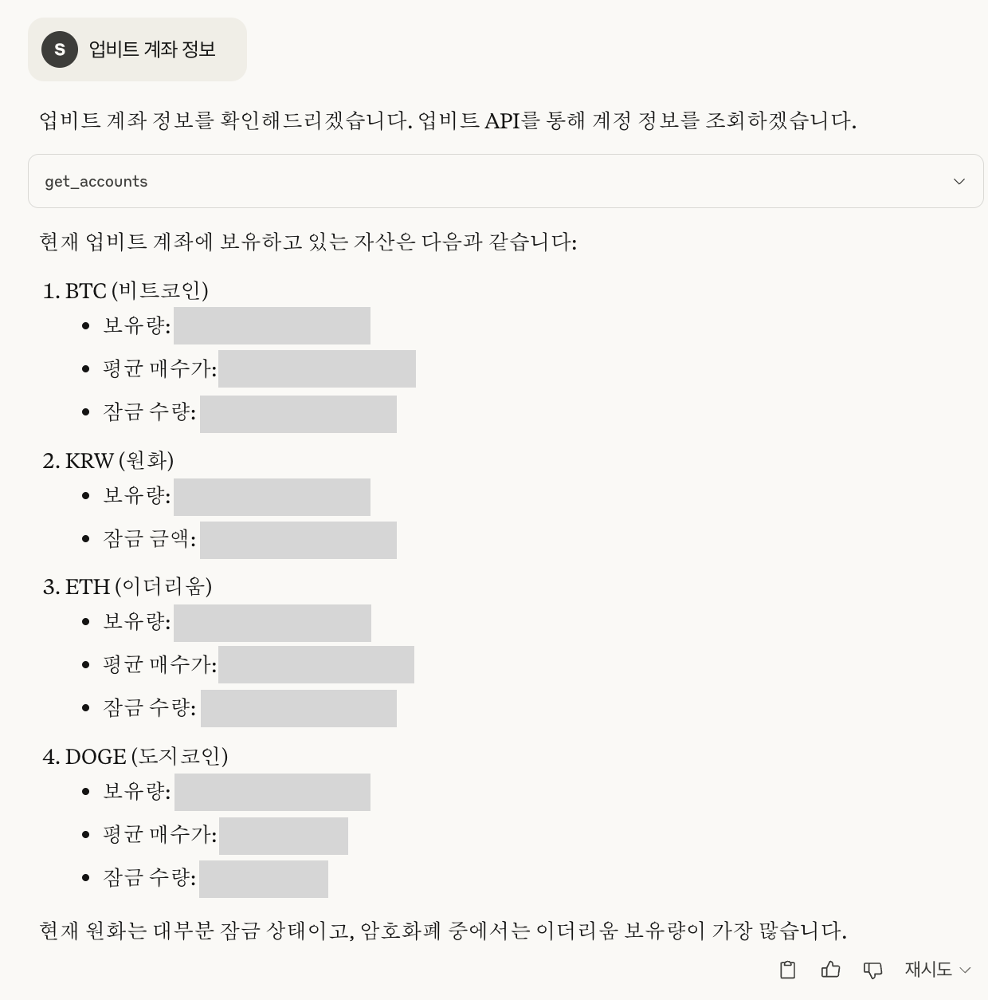

# Upbit MCP Server

A server implementation for [Upbit](https://upbit.com) Cryptocurrency Exchange OpenAPI using the Model Context Protocol (MCP). This project provides tools to interact with Upbit exchange services, such as retrieving market data (quotes, orderbooks, trade history, chart data), account information, creating and canceling orders, managing deposits/withdrawals, and performing technical analysis.

## Features

- Market data retrieval (ticker, orderbook, trades, candle data)
- Account information (balance, order history)
- Order creation and cancellation
- Deposit and withdrawal functions
- Technical analysis tools

<details>
  <summary><strong>수행가능한 기능 목록</strong></summary>
  <br/>

  <h4>시장 데이터 조회</h4>
  <ul>
    <li>현재 암호화폐 시세 조회 (<code>get_ticker</code>)</li>
    <li>호가창 정보 조회 (<code>get_orderbook</code>)</li>
    <li>최근 체결 내역 조회 (<code>get_trades</code>)</li>
    <li>주요 암호화폐 시장 요약 정보 확인 (<code>get_market_summary</code>)</li>
  </ul>

  <h4>계정 정보 조회</h4>
  <ul>
    <li>보유 중인 자산 목록 및 잔고 확인 (<code>get_accounts</code>)</li>
    <li>주문 내역 조회 (<code>get_orders</code>)</li>
    <li>특정 주문 상세 정보 조회 (<code>get_order</code>)</li>
    <li>입출금 내역 조회 (<code>get_deposits_withdrawals</code>)</li>
  </ul>

  <h4>거래 기능</h4>
  <ul>
    <li>지정가/시장가 매수 주문 생성 (<code>create_order</code>)</li>
    <li>지정가/시장가 매도 주문 생성 (<code>create_order</code>)</li>
    <li>주문 취소 (<code>cancel_order</code>)</li>
  </ul>
</details>

<details>
  <summary><strong>채팅 예시</strong></summary>
  <br/>
  <p>
    아래는 실제 채팅 예시 이미지입니다.
  </p>
  
    
</details>

## Prerequisites

Before you begin, you need to get your Upbit API keys:

1. Create an account on [Upbit](https://upbit.com) if you don't already have one
2. Go to the [Upbit Developer Center](https://upbit.com/service_center/open_api_guide)
3. Create a new API key
4. Make sure to set appropriate permissions (read, trade, withdraw as needed)
5. Store your API keys(`UPBIT_ACCESS_KEY`, `UPBIT_SECRET_KEY`) in the `.env` file (see Installation section)

## Installation

1. Clone the repository:
   ```bash
   git clone https://github.com/solangii/upbit-mcp-server.git
   cd upbit-mcp-server
   ```

2. Install dependencies:
   ```bash
   cd upbit-mcp-server
   uv sync
   ```
   
   If you don't have `uv` installed yet, you can install it as follows:
   
   Using `uv` provides faster installation and more reliable dependency resolution.

   ```bash
   # Install uv
   curl -Ls https://astral.sh/uv/install.sh | sh
   
    # Add uv to your PATH
   echo 'export PATH="$HOME/.local/bin:$PATH"' >> ~/.zshrc
   source ~/.zshrc  # or bashrc, depending on your shell
   ```

3. Set up environment variables:
   Create a `.env` file in the project root and add your Upbit API keys:
   ```
   UPBIT_ACCESS_KEY=your_access_key_here
   UPBIT_SECRET_KEY=your_secret_key_here
   ```

## Usage

### Install in Claude Desktop

#### Option 1: Using Claude config file (Direct integration)

You can add the MCP server directly to Claude's configuration file:

1. Install [Claude Desktop](https://claude.ai/download)

2. Add the following to your Claude Desktop configuration:

   - macOS: ``~/Library/Application Support/Claude/claude_desktop_config.json`
   - Windows: `%APPDATA%\Claude\claude_desktop_config.json`

3. Add the following configuration (adjust paths as needed):
   ```json
   {
     "mcpServers": {
       "upbit-mcp-server": {
         "command": "/full/path/to/upbit-mcp-server/.venv/bin/python",
         "args": [
           "/full/path/to/upbit-mcp-server/main.py"
         ]
       }
     }
   }
   ```
   
4. Restart Claude to load the new configuration.

#### Option 2: Using fastmcp

```bash
fastmcp install main.py --name "Upbit API"
```

### Run Directly with Python

```bash
uv run python main.py
```

### Development Mode (Web Interface)

```bash
fastmcp dev main.py
```

## Caution

- This server can process real trades, so use it carefully.
- Keep your API keys secure and never commit them to public repositories.

## License

MIT
